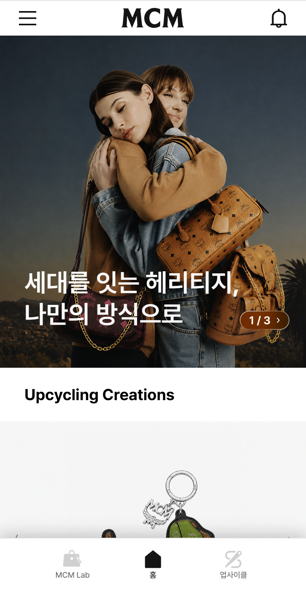
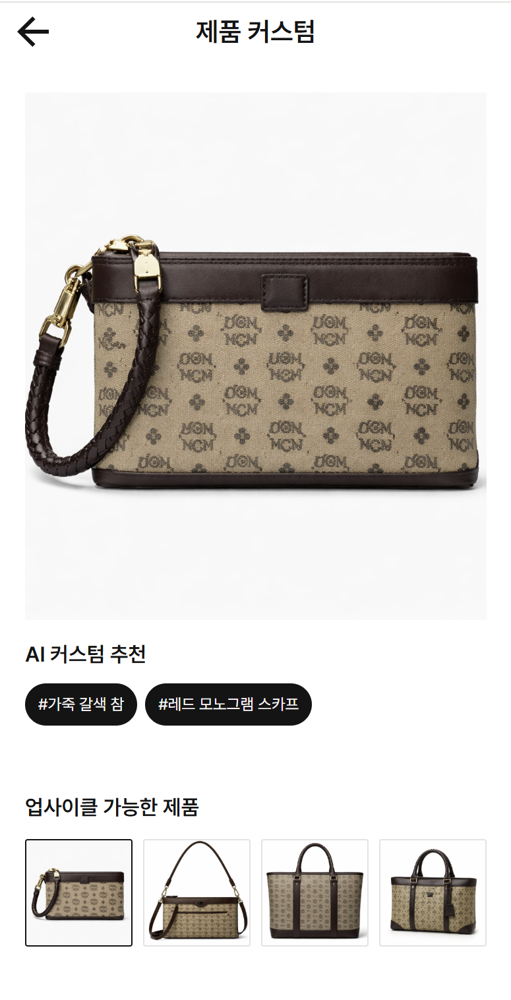
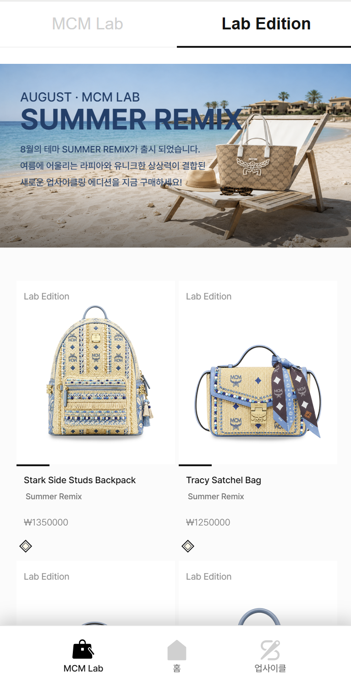
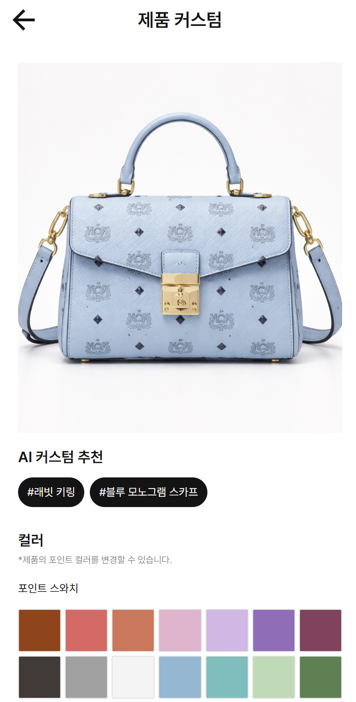

# MCM ATELIER

**🔗 배포 링크**: [https://mcmheritage.netlify.app/](https://mcmheritage.netlify.app/)

## 📱 서비스 소개
**MCM ATELIER**는 MCM의 업사이클링 헤리티지를 고객의 직접적인 창작과 오프라인 브랜드 경험으로 확장하는 참여형 AI 업사이클링 플랫폼입니다. AI 이미지 생성에 그치지 않고, 고객의 창작을 실제 MCM 제품과 매장 경험으로 연결하는 데 핵심 가치를 둡니다.

## 🎯 문제 정의
- 온라인 쇼핑이 일상화되며 오프라인 매장은 온라인에서 대체 불가능한 경험을 제공해야 하는 과제에 직면
- EY Luxury Client Index 2026: 브랜드 스토어가 최근 구매의 최종 채널이었던 비율 71%, 경험 제공 브랜드 재구매 의향 75%, 최근 12개월간 무료 경험/초대 부재 응답 30%
- MCM은 RUN Project 등으로 업사이클링을 실천 중이나, 브랜드의 실천과 고객의 직접 참여는 다른 문제
- **MCM ATELIER는 이 간극을 해결** — 고객이 자신의 MCM 제품을 AI와 재해석하고, 실제 제작 가능한 범위에서 디자인을 완성 → 매장 접수 → 전문가 제작 → 완성품 수령까지 연결

## ✨ 핵심 기능

### 1. 업사이클(Upcycle)
제품 사진 등록 → AI 분석 → 실제 제작 가능한 소재/컬러/참/키링/스카프 옵션 범위 내에서 디자인 시각화 → 커스터마이징 → 매장 예약 → 접수 → 제작 → 수령

- AI는 완성품을 임의 생성하지 않고, **실제 제작 가능한 범위**를 기반으로 시각화 (제작 현실성 확보)
- AI(빠른 시각화)와 전문가(최종 검수·제작)의 역할 분리 — EY 조사: 럭셔리 소비자 94%가 AI의 쇼핑 경험 향상 가능성에 공감, 72%는 인간적 접점 상실 우려

### 2. MCM Lab
월별 디자인 테마·소재 제시 → 고객이 AI로 창작 → 유저 투표 + MCM 심사로 우수작 선정 → 실제 제품 제작 및 오프라인 전시로 연결 (초기 MVP 이후 확장 기능)

## 🚀 실행 전략

**1단계 — B2C MVP**
특정 매장·제한된 제품군 대상, 제품 등록 → AI 생성 → 커스터마이징 → 예약 → 접수·수령까지 핵심 여정 구현.
- 핵심 가설: "AI 창작 경험이 실제 구매·방문으로 이어지는가"
- 핵심 KPI: 디자인 생성→예약 전환율, 예약→방문율, 구매 전환율, 재방문율
- 수익원: 기본 제작비 + 커스터마이징 옵션 비용

**2단계 — 서비스 확장**
검증된 제품군·매장으로 확대, MCM Lab 정기 프로그램화, 우수 창작물 한정 제품 제작·판매, AI 개인화 고도화

**3단계 — 협업 확장**
아티스트·패션·라이프스타일 브랜드와 공동 디자인, 한정 컬렉션, 전시 등으로 사업 확장

## 🛠️ 기술 스택

**Frontend**
- React 19
- Vite
- JavaScript (JSX)

**상태 관리**
- React 기본 Hooks (`useState`) + `react-router-dom`의 `location.state`

**라우팅**
- React Router DOM v7

**스타일링**
- styled-components

**API 통신**
- Axios

**애니메이션**
- Framer Motion

**기타**
- JsBarcode (바코드 생성)

**배포**
- Netlify

## 📸 스크린샷

| 홈 | 업사이클 커스텀 |
|---|---|
|  |  |

| Lab Edition | MCM Lab 커스텀 |
|---|---|
|  |  |

---

## **🎯 Git Convention**
- 🎉 **Start:** Start New Project [:tada:]
- ✨ **Feat:** 새로운 기능을 추가 [:sparkles:]
- 🐛 **Fix:** 버그 수정 [:bug:]
- 🎨 **Design:** CSS 등 사용자 UI 디자인 변경 [:art:]
- ♻️ **Refactor:** 코드 리팩토링 [:recycle:]
- 🔧 **Settings:** Changing configuration files [:wrench:]
- 🗃️ **Comment:** 필요한 주석 추가 및 변경 [:card_file_box:]
- ➕ **Dependency/Plugin:** Add a dependency/plugin [:heavy_plus_sign:]
- 📝 **Docs:** 문서 수정 [:memo:]
- 🔀 **Merge:** Merge branches [:twisted_rightwards_arrows:]
- 🚀 **Deploy:** Deploying stuff [:rocket:]
- 🚚 **Rename:** 파일 혹은 폴더명을 수정하거나 옮기는 작업만인 경우 [:truck:]
- 🔥 **Remove:** 파일을 삭제하는 작업만 수행한 경우 [:fire:]
- ⏪️ **Revert:** 전 버전으로 롤백 [:rewind:]

## 🌲 Branch Convention
- **`main`**: 배포 가능한 브랜치, 항상 배포 가능한 상태를 유지
- **`develop`**: 다음 버전을 위한 개발 브랜치, 팀원들의 작업 결과물이 모이는 '중심점'
- **`ui/#이슈번호/명칭`**: 화면 UI 구현이나 스타일링 작업을 할 때 사용
  - _예: `ui/#12/login-form`_
- **`api/#이슈번호/명칭`**: 데이터 통신, API 연동, 비즈니스 로직 구현 시 사용
  - _예: `api/#45/fetch-user-profile`_

## 🌊 Flow
1. Issue 생성
2. 최신 상태의 **`develop`** 에서 새 브랜치 생성
3. 작업 완료 후 **`develop`**으로 Pull Request
4. 팀원들에게 리뷰 요청
5. 리뷰한 팀원이 **`develop`** 으로 병합
6. 병합 후 작업자가 해당 브랜치 삭제